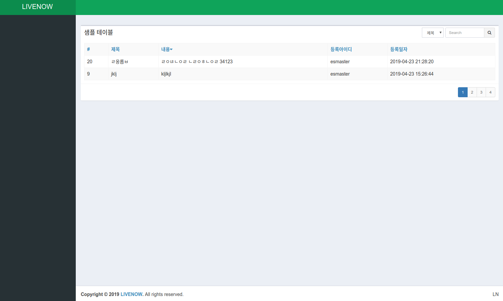

# simpleTable

</img>

## 배경
- 일반적인 웹사이트 개발시 Backend 단에 만들어지는 정적인 페이지의 한계가 발생함
> 예) 검색이나 페이징시 전체 페이지 전환없이 보여주세요!, 동일한 데이터인데 정렬이나 검색시 매번 서버에 요청해야 하나요?

- Backend에서는 JSON 형태의 "HTTP API"로 데이터를 전달해 주고 Frontend에서 사이트에 맞춰 구현하여 Backend를 재활용할 수 있는 구조가 요구
=> 응답값의 형태 및 설명을 통해 어떤 클라이언트든지 API 처럼 활용이 가능
=> Frontend 와 Backend 분리로 협업에서 분리가 단순해짐

## 한계
- 기존 퍼블리싱된 코딩이 jQuery 로 활용되고 있기에 기존 jQuery 를 활용할 수 있도록 해야함
(jQuery에서 벗어나고 싶지만, 혼자 하는 작업이 아닌지라 현실적인 대응으로 접근)

- vue 를 인라인 형태로 사용
(vue-cli (webpack) 와 es2015 문법을 활용하여 적극적인(?) component 방식으로 개발하고 싶지만 현실적인 대응으로 es5 로 사용하도록 접근)

- 일반적인 테이블 구조만을 제공되며, 사이트의 요구사항에 맞춰 변형하여 사용할 수 있도록 해야 함

- 검색엔진이 javascript 를 실행하여 해석하지 않는다면 SEO 에서는 빵점.

## 기본지원 기능

- 브라우저 뒤로가기 기능 지원
( 뒤로가기를 통해 웹사이트를 탐방하는 경우가 비일비재함 )

- 정렬, 검색, 페이징의 복합적인 기능 지원
> 정렬의 파라미터 형태는 정렬키:정렬타입 ( 예) title:desc )

## 구성방식

3개의 컴포넌트로 구성하여 각 컴포넌트에 해당되는 3개의 템플릿 수정을 통해 가공이 가능
- customSearchBar : 검색 컴포넌트
- customPagination : 페이지네이션 컴포넌트
- customList : 목록 컴포넌트

adminlte(bootstrap 기반 오픈소스 템플릿(?)) 기반으로 하여 샘플은 만들어짐

## 의존성

샘플을 보여주기 위해서 적용된 것을 제외하고 아래 4개의 의존성을 가지고 있음
- vue
- vue-router
- lodash
- jquery ( non-jquery 브런치에 jquery 의존성을 제거한 버전 반영 )

## 참고

jquery가 싫다면 https://plainjs.com/ 와 같은 사이트를 이용하여 jQuery 기능들을 대체하여 적용해도 좋을 듯 함

